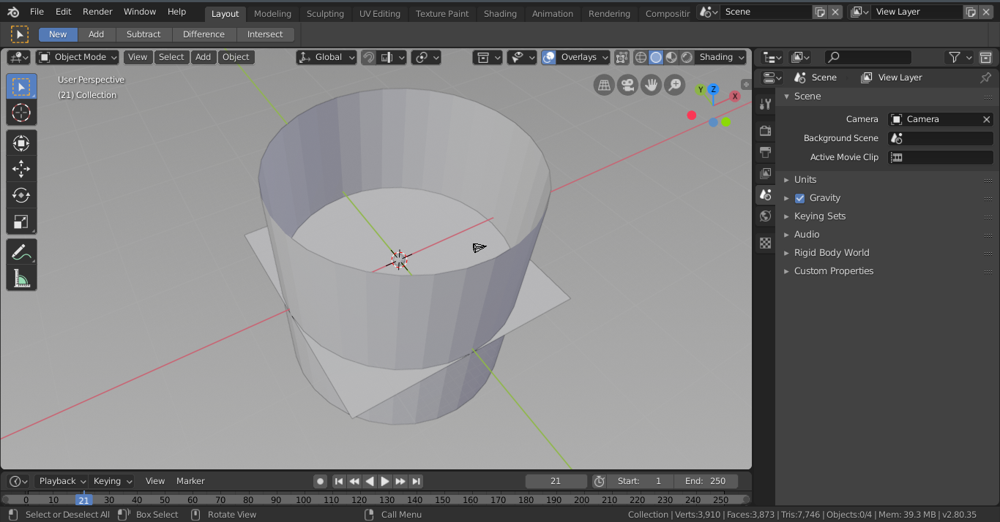

# Simple Brownian Motion in Blender

In this first tutorial we will create a single particle, with some texture and material properties, and use Python 3.x to simulate simple Brownian motion. If you are not familiar with the basics of Blender, you can still follow this tutorial but I recommend checking out some of the links provided in the main README file. In this project we use a mix of Blender graphical interface and the Blender Python scripting to create our final simulation. Specifically we will create the our meshes, materials, and textures using the graphical interface, and afterwards simulate the Brownian motion of the object using the Python scripting. This project was created in Blender 2.8 and used Cycles Render engine. 

### Modelling our objects
First let's make the objects before we simulate their trajectories. Open a new Blender *.blend* file and delete the Default Cube and Default Light. Also ensure the rendering engine is set to Cycles (Eevee is also a great engine, however I do not know how the materials look in Eevee).


Let's add back in a mesh as our main Brownian particle. In this first example we will only use one. Add an **IcoSphere** and change *Subdivisions > 3*. Let's change the name of the mesh to "Particle". Now let's add some texture to this mesh so that when it rotates it is a bit easier to see. We will use *Modifiers* to do so. Navigate to *Modifiers > Add Subdivision Surface* and add this. Add a second modifier as *Modifier > Displace*, follwer by another *Subdivision Surface* (order is important here). The *Displace* modifier should automatically add a Texture (named "Texture") -- which defines how the mesh will change and gives some "bumpiness". Switch to *Textures* and switch to Voronoi, reduce Intensity to around 0.4. Now we have a bumpy-looking sphere. 


Let's add a Material. Navigate to *Materials* and add a Principled Shader. We will just use a simple metallic-type material, with the node settings as below. 


To round out the simple scene we'll add a floor and a light. For the floor, *Add > Mesh > Plane*, scaled by 15 and shifted down in the Z-direction by -1. We then add a simple Material which is meant to look kinda of like a matte gold finish.
For the some lights, we add a cylinder and scale by 15. Set the Material to *Emission* with *Strength = 1.0*.



One of the things with physics simulations is that they often represent things which humans have never seen directly - and are instead models. This means that there is plenty of creative control with the scene, so materials, geometry, and texture are largely up to you. This is not meant to be a photo-realistic image. Plus this tutorial is more about the scripting. Taking a quick look, our particle is a bumpy, metallic-looking ball of sorts -- now let's making it move.


So now our scene is set, lets get to the scripting and making our objects move.

### Simulating our trajectories
The reason Blender is great for science visualizations is that it uses Python as a scripting language, which as quickly become a de-facto standard in many fields. The Blender scripting is done with the `bpy` library, and allows for creating and manipulating objects, animations, etc. Everything we did above to create the scene could be done witht the Python library. Switching to the *Scripting* tab, we can open the *.py* script to run.

First we import our libraries.

```
import bpy
import mathutils as mu
import numpy as np
```

The library `mathutils` provides access to certain math objects used by `bpy`, including `Vectors()`, `Matrix()`, `Quaterions()`, and more. `numpy`, as the standard for numeric computing in Python, is used for the random sampling.

We will simulate a very simple motion, where the particle translates its location by a random amount drawn from a normal distribution. The distribution could correspond to thermodynamic properties, but for now we will treat it as a dimensionless value that looks good in the simulation. We also rotate around the global X, Y, and Z axis by a random angle, also drawn from a normal distribution. We define some parameters to the simulation

```
NUM_FRAMES          = 250 # the total number of frames to animate for
SKIP_FRAMES         = 2 # this controls how many locations to set as keyframes
BROWN_LOC_STRENGTH  = 0.2 # this is a dimensionless unit which controls how much the particle can move from the current position
BROWN_ROT_STRENGTH  = 0.25 # this is a dimensionless unit which controls how much the particle can move from the current position
LOC_SWITCH          = np.array([1, 1, 0]) # (X,Y,Z) Boolean values to constrain certain dimensions
```

Then we will clean our scene a bit before we start, in case anything was changed or we have already run the script once.
```
scene = bpy.context.scene # set a shorter variable to the whole scene

scene.frame_start, scene.frame_end = (1, NUM_FRAMES) # set our animation frame lengths
bpy.context.scene.frame_set(scene.frame_start) # move to the first frame

obj = bpy.data.objects['Particle'] # ensure this matches with the name of the particle mesh
obj.delta_location = mu.Vector([0,0,0])
obj.location = mu.Vector([0,0,0])
obj.animation_data_clear()
```

It is very important that the name of the mesh we created earlied matches with the name we call in `obj = bpy.data.objects['Particle']`. 

The main bulk of the work will be done a defined function, which we call `random_rot_loc_change()`, and will perform the random translation/rotation based on the width of the normal distribution. It will also interpolate between frames based on the interpolation method which is passed in.

```
def random_rot_loc_change(obj, BROWN_LOC_STRENGTH, BROWN_ROT_STRENGTH, INTERPOLATION):
    ## Generate a random translation matrix rom the current location, drawn from a normal distribution (and fixed in the desired dimensions)
    loc_mat = mu.Matrix.Translation(list(np.random.normal(0, BROWN_LOC_STRENGTH, 3) *  LOC_SWITCH))

    # generate a random rotation (rotations in 3 dimensions)
    rot_mat = mu.Matrix.Rotation(np.random.normal(0,BROWN_ROT_STRENGTH), 4, 'X') @ mu.Matrix.Rotation(np.random.normal(0,BROWN_ROT_STRENGTH), 4, 'Y') @ mu.Matrix.Rotation(np.random.normal(0,BROWN_ROT_STRENGTH), 4, 'Z') 

    # decompose current object's world_matrix's components, and from them assemble 4x4 matrices
    orig_loc, orig_rot, orig_scale = obj.matrix_world.decompose()
    orig_loc_mat = mu.Matrix.Translation(orig_loc)
    orig_rot_mat = orig_rot.to_matrix().to_4x4()
    orig_scale_mat = mu.Matrix.Scale(orig_scale[0],4,(1,0,0)) @ mu.Matrix.Scale(orig_scale[1],4,(0,1,0)) @ mu.Matrix.Scale(orig_scale[2],4,(0,0,1))

    # Now update the world_matrix, applying our random tranformations
    obj.matrix_world = loc_mat @ orig_loc_mat @ rot_mat @ orig_rot_mat @ orig_scale_mat
        
    # save the transformation as a keyframe for animation
    obj.keyframe_insert(data_path="location")
    obj.keyframe_insert(data_path="rotation_euler")
     
    # change the interpolation type for smooth movement
    for fcurve in obj.animation_data.action.fcurves:
        kf = fcurve.keyframe_points[-1]
        kf.interpolation = INTERPOLATION
```

Now that the hard work is done, we simply loop through all the frames in the animation and move the particle based on our simple Brownian motion.

```
for frame in range(scene.frame_start, scene.frame_end+1, SKIP_FRAMES):
    
    # move to the current frame
    bpy.context.scene.frame_set(frame)
    random_rot_loc_change(obj, BROWN_LOC_STRENGTH, BROWN_ROT_STRENGTH, 'BEZIER')
```

To run the script navigate to *Text > Run Script*. And voila, we should have the particle moving. Play back the animation to ensure everything worked properly and then setup the render settings (note that the particle could go out of the field-of-view depending on the motion). In *Render*, set the settings you desire and from the drop-down menu start *Render Animation*. This is the long part as the computer renders each frame - so sit back and find a book to read. Once the render is finished, each frame should be exported as an image which can then be stitched together to create the animation (see [Rendering Animations](https://docs.blender.org/manual/en/latest/render/workflows/animations.html) for more information).


